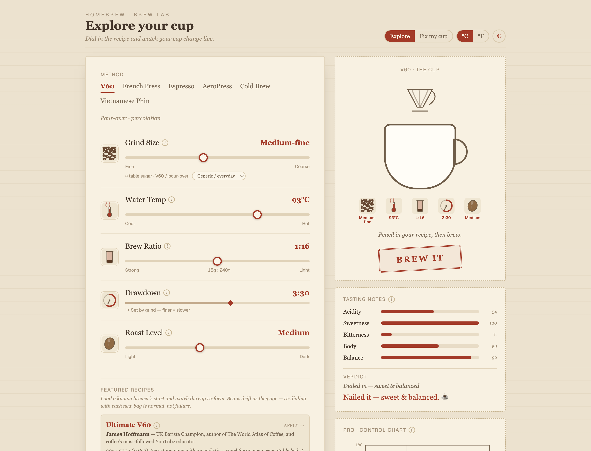
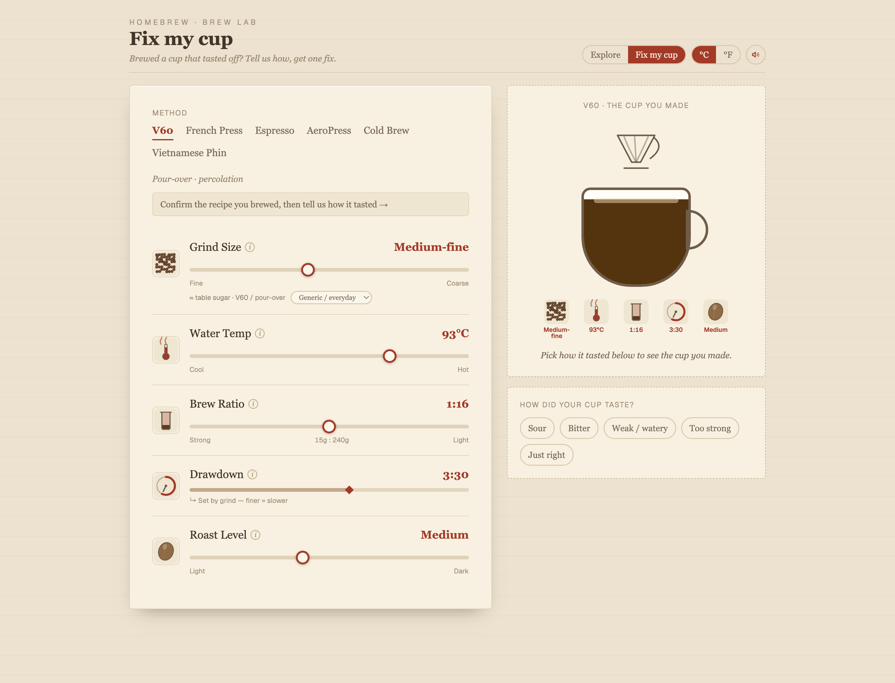
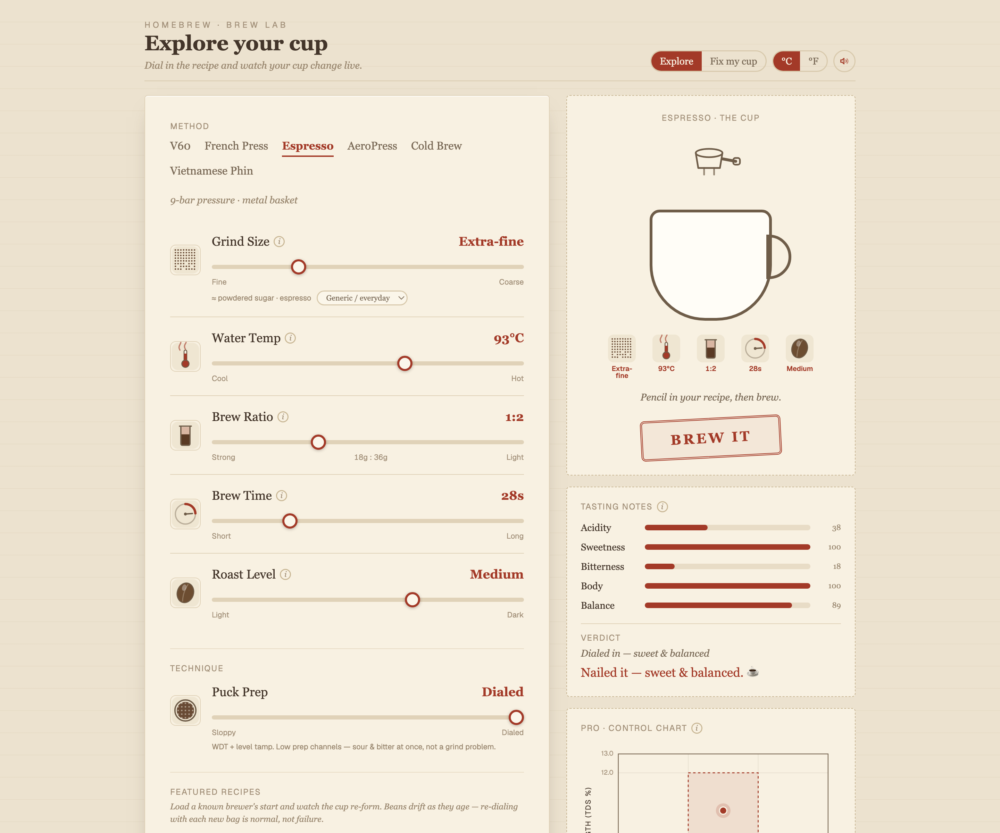

# Homebrew — Coffee Brewing Playground

An interactive, single-screen web app where you tweak brewing variables and
watch, in real time, how the resulting coffee changes. Drag a knob — grind,
water temp, ratio, time, roast — and the cup, the tasting notes, and the verdict
re-form live. It's a playground, not a tutorial: the science is woven into the
controls so you learn by experimenting. Grounded in published coffee science
(SCA, James Hoffmann, Scott Rao, Barista Hustle, Gagné, Hendon).



## What it does

- **Explore (forward mode)** — Adjust the **Variables** and everything updates
  as you drag: the **Cup Visualization** fills, the **Taste Profile** bars move,
  and the **Verdict** tells you in plain language how the cup landed. Hit
  **Brew it** for the flourish.
- **Fix my cup (reverse mode)** — Already brewed a cup that tasted off? Confirm
  the recipe you used, pick how it tasted (sour, bitter, weak, too strong…), and
  the app prescribes the single concrete fix and offers to **Apply** it.

  

- **Methods** — V60/pour-over, French press, Espresso, AeroPress, Cold brew, and
  Vietnamese phin. Each sets its own defaults, ranges, and brewing regime (e.g.
  V60 *derives* drawdown time from grind; immersion methods keep time a free
  knob — see ADR-0006).
- **Featured Recipes** — Load a known brewer's settings (e.g. a champion's V60)
  and watch the knobs animate to those values.
- **Pro view** — An opt-in toggle for baristas that reveals the **Control Chart**
  with TDS/Extraction-Yield numbers and the ideal box. Off by default; never
  required. Espresso also exposes a **Puck Prep** technique slider that drives
  extraction *evenness*.

  

- **Inline learning** — An info icon on every Variable and a "Why?" expander on
  the Verdict, all from one content source so the tooltip and the reasoning
  never drift apart.

State lives in the URL (method, variables, mode, pro, grinder…), so any cup is
shareable and refresh-safe.

## Stack

Vite · React 19 · TypeScript · Tailwind CSS v4 · shadcn/ui (Radix) · Motion ·
TanStack Router.

## Scripts

```bash
npm run dev        # start the dev server
npm run build      # typecheck (tsc -b) + production build
npm run typecheck  # type-check only
npm run lint       # eslint
npm run preview    # preview the production build
```

## Structure

- `src/lib/coffee/` — deep, pure, no-UI domain modules: the Extraction Engine,
  Taste Mapper, Coach, method specs, and shared types.
- `src/lib/brew-search.ts` — the URL search-param schema that is the app's state.
- `src/components/playground/` — the Playground screen and its panels.
- `src/components/ui/` — shadcn/ui components.

## Docs

See [`CONTEXT.md`](./CONTEXT.md) for the domain glossary and
[`docs/adr`](./docs/adr) for architecture decisions.
